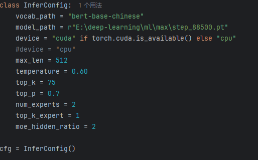
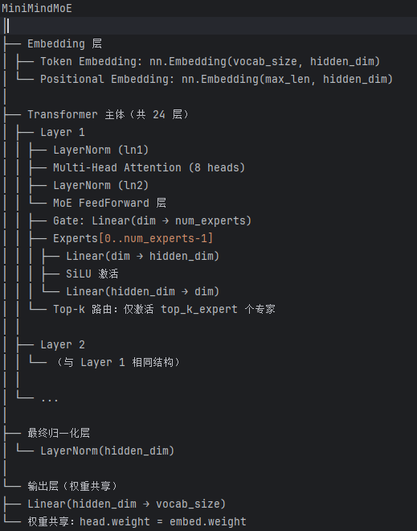

# 从稠密 LLM 到 Mixture of Experts（MoE）

---

## 一、问题背景

上一个版本中，我们从头训练了一个 **稠密（Dense）LLM 模型**。  
但是稠密 LLM 模型有一个显著的问题 —— **资源浪费**。

传统的稠密（Dense）LLM 模型在训练和推理时，**所有参数都会被同时激活参与计算**。  
随着模型规模扩大（例如上千亿参数），这种方式会带来**巨大的计算和显存开销**，导致**资源利用率低、推理效率差**。

---

## 二、MoE 的诞生

为了解决这一问题，**Mixture of Experts（MoE，专家混合模型）** 应运而生。  
这次我们将 **从 0 到 1 实现一个 MoE 模型**。

---

## 三、MoE 的定义说明

### 1️⃣ 定义

> **Mixture of Experts（MoE）** 是一种 **稀疏化神经网络结构**。  
> 其核心思想是：模型包含多个不同的“专家”子网络（Experts），  
> 对于每一个输入样本或 token，仅激活其中一部分专家参与计算，  
> 而非让全部参数都参与，从而在保持模型容量巨大的同时，显著提高计算效率。

---

### 2️⃣ MoE 的基本组成

一个典型的 MoE 模型包含三大核心模块：

#### （1）专家网络（Experts）

- 一组并行的子模型（通常是 **MLP 层**）。  
- 每个专家可以看作是一个“特定领域”的专长网络，学习处理特定类型的输入特征。

#### （2）门控网络（Gating Network）

- 用于 **决定每个输入应该激活哪些专家**。  
- 通常输出一个概率分布（Softmax 或 Top-k 选择），表示各专家的权重或选择概率。

#### （3）加权合并（Weighted Combination）

- 将被选中的专家输出按照门控权重加权求和，  
  得到最终输出结果。

📘 **总结**  
MoE 模型通过“稀疏激活”机制，在不显著增加计算成本的前提下，  
实现了与超大稠密模型相当的参数容量和表达能力。

----
## 四、我们mini-moe-llm的结构
默认版本已经写在了config类下

结构说明如下

ps：如果要训练自己的模型，比如更深，更多专家可以在config里设置修改
----
----
具体的操作方式可以详见这个系列的第一个仓库

本项目由实现了代码的通用模块化，其余不用修改，适配数据集，直接拉去根据自己的设备设定模型便可以开始训练

上一个仓库地址:https://github.com/ngxc/mini-llm

